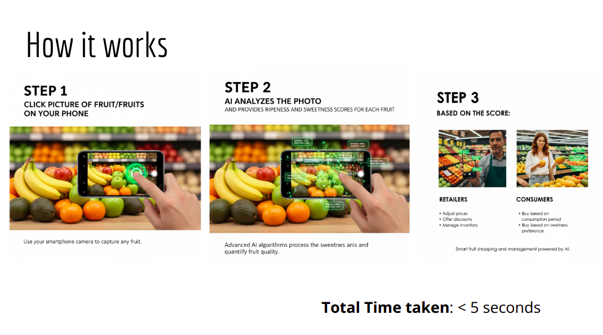
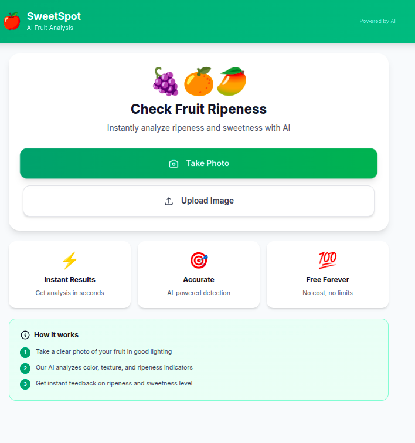
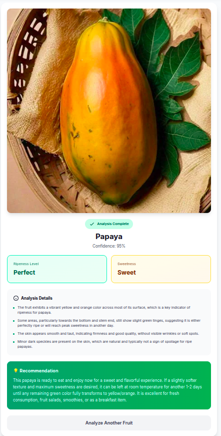

# 🍎 SweetSpot – AI Fruit Analysis

SweetSpot is a simple **Progressive Web App (PWA)** powered by **Gemini AI** that helps consumers and retailers analyze fruit ripeness, sweetness, and freshness instantly from an image.  

By sending a photo of the fruit to the Gemini API with a carefully designed prompt, the app can:
- Identify the fruit name
- Predict its ripeness and sweetness level
- Provide personalized recommendations (when to eat, storage, or sales suggestions)

  
---

## 📸 Demo Screenshots  

### Fruit Analysis Example  
  

### Home Screen – Check Fruit Ripeness  
  

---

## ✨ Features  

### For Consumers  
- 📷 **Analyze fruits before buying** – ensure maximum taste and quality  
- 🍽 **Plan consumption**:  
  - Eat today → choose perfectly ripe fruit  
  - Eat tomorrow → pick slightly underripe fruit  
- 🥗 **Get the best taste** – avoid spoilage by consuming fruits in the right order  

### For Retailers  
- 🏬 **Optimize inventory** – detect fruits that must be sold today  
- 💰 **Reduce wastage** – add discounts on fruits close to spoilage  
- 📊 **Track fruit lifecycle** – record images and conditions to understand spoilage patterns  
- 🌱 **Improve storage** – adjust environment conditions based on spoilage insights  

---

## 🛠 Tech Stack  

- **Frontend**: PWA (HTML, Tailwind CSS, basic JS/Flutter integration possible)  
- **Backend**: Simple Python Flask server  
- **AI Model**: Gemini 2.5 Flash API (image + text prompt)  

---

## 🚀 How It Works  

1. **Take or upload a fruit photo** in good lighting  
2. **Send to Gemini API** with a tailored prompt  
3. **AI analyzes**:
   - Fruit type  
   - Ripeness level  
   - Sweetness level  
   - Recommendations  
4. **Instant results** shown in the app  

---

## 🔮 Roadmap  

- [ ] Add support for more fruit categories  
- [ ] Build a full inventory management dashboard for retailers  
- [ ] Enable spoilage prediction based on historical data  
- [ ] Multi-language support  

---

## 💡 Why SweetSpot?  

Every year, tons of fruits are wasted due to improper storage and poor consumption planning. SweetSpot makes fruit consumption smarter by helping **consumers enjoy fruits at their peak** and **retailers reduce waste & improve sales**.  

---

## 📜 License  

This project is licensed under the MIT License – feel free to use and improve it.  

---

